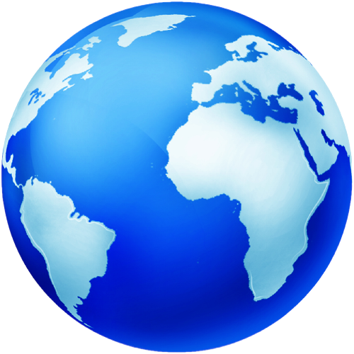

## **Выпускной проект**
-----------------------------------------------------------------------------------------------------------------------------------------------------
# **ТУРИСТИЧЕСКИЙ СПРАВОЧНИК**

----------------------------------------------------------------------------------------------------------------------------------------------------- 
## **Реализация**

#### **CompileSDK:** ***31***  
#### **MinSDK:** ***21***  
#### **TargetSDK:** ***31***
----------------------------------------------------------------------------------------------------------------------------------------------------- 
### **Используемый язык программирования:** ***Kotlin*** 
### **Архитектура проекта:** ***MVVM***   
-----------------------------------------------------------------------------------------------------------------------------------------------------
### **Технологии:**  
***Retrofit*** - работа с АПИ сервиса со встроенным Json парсером на базе OkHttp,   
***RecyclerView*** - отображение списка элеметнов,   
***RXJava2*** - работа с асинхронным кодом,   
***Dagger2*** - внедрение зависимостей,   
***ViewModel*** - сущность для хранения и управления данными, связанными с представлением,   
***LiveData*** - хранилища с возможностью наблюдения за приходящими данными,  
***Navigation Fragments*** - упрощение реализации навигации между экранами,  
***Google Maps*** - работа с картами от Google,  
***Picasso*** - загрузка изображений из API во View,  
***Pixplicity/Sharp*** - конвертация изображений из формата SVG в Drawables,  
***JUnit*** - Unit–тестирование,  
***Espresso*** - UI–тестирование. 

 -----------------------------------------------------------------------------------------------------------------------------------------------------   
### **Функционал:** 
- Приложение получает список стран с открытого сервиса API 1 и позволяет пользователю ознакомиться со справочной информацией по ним 
- Приложение даёт пользователю возможность найти любую страну, пользуясь поиском   
- Приложение отображает изображение государственного флага каждой страны 
- Приложение позволяет пользователю узнать географическое положение всех стран мира на карте 
- Приложение получает подборку изображений с открытого сервиса API 2 и позволяет пользователю полюбоваться красивыми видами и достопримечательностями 
- Приложение отображает статус загрузки данных
- Приложение обрабатывает ошибки, ситуации поворота экрана, отсутствия интернета и т.д.
-----------------------------------------------------------------------------------------------------------------------------------------------------
### **Публичный сервис API 1(страны):** ***[https://travelbriefing.org/](https://travelbriefing.org/)***
### **Публичный сервис API 2(изображения):** ***[https://pixabay.com/](https://pixabay.com/)***
-----------------------------------------------------------------------------------------------------------------------------------------------------